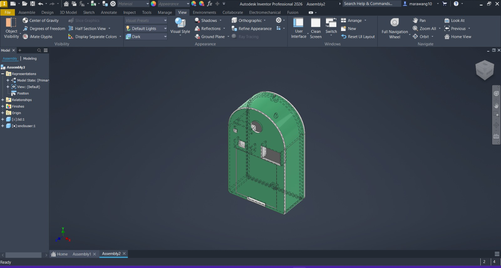
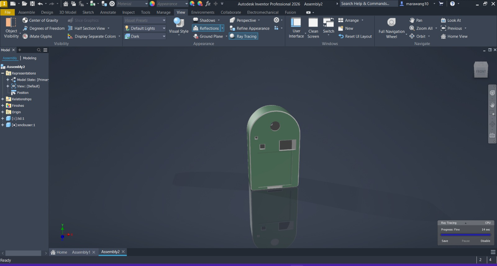

# Smart Facial Recognition Security System

This project is a **smart security system** using an **ESP32-CAM**, **Raspberry Pi Pico W**, and a **240x135 Adafruit color TFT**, with **facial recognition**, motion detection, and optional manual keypad entry. It is designed to allow known users immediate access and provide temporary keypad-based access for unknown users while saving power.

---

## Overview

The system performs **facial recognition** via the ESP32-CAM and communicates the results to the Pico W:

- **Known users**: immediate entry, TFT shows the user's name.
- **Unknown users**: after 3 consecutive unknown detections in a short interval, the system prompts for a **manual password** on a 4x4 keypad. Users get **two attempts**.
  - **Correct password** → Access granted.
  - **Failed attempts** → Access denied.
- **Power-saving**: The ESP32-CAM stays in **sleep mode** by default to reduce heat and power consumption. It only activates when **motion is detected**.
- **Motion detection**: The system uses an **EN18 PIR sensor (Passive Infrared Sensor)** to detect nearby presence:
  - Motion detected → camera activates, TFT flash turns on.
  - No motion for 5 seconds after a user leaves → system shuts down.

The TFT shows **entry status** and the detected person (`Anas` or `Marawan` by default). These names are **pre-coded in the ESP32-CAM** and can be updated when enrolling new users.

---

## System Components

1. **ESP32-CAM**
   - Performs **facial recognition**.
   - Sends detected user information to the Pico W via **UART**.
   - Pre-coded IDs correspond to user names; customizable for future users.

2. **Raspberry Pi Pico W**
   - Handles **TFT display**, **motion logic**, and **password entry**.
   - Activates or deactivates system based on motion signals from the EN18 PIR sensor.
   - Manages **manual keypad input** for unknown users.

3. **EN18 PIR Sensor (Passive Infrared Sensor)**
   - Detects motion in front of the system.
   - Triggers ESP32-CAM activation and TFT flash for visibility.

4. **240x135 Adafruit Color TFT**
   - Displays system **status** and **detected user**.
   - Shows **password prompts** and access messages.

5. **4x4 Keypad**
   - Allows manual entry of a password when unknown users are detected.

6. **GSM Module** *(for future features)*
   - Can notify the owner in case of security events (not implemented yet).

## Project Structure
.
├── Code/
│ ├── PicoW_Code/ # Raspberry Pi Pico W scripts
│ └── ESP32_CAM/ # Modified CameraWebServer code + HTML modification script
├── Enclosure_Files/ # 3D enclosure IPT files
├── Snaps/
│ ├── en1.png # Snapshots of 3D enclosure
│ └── En2.png
├── Security_System_Schematic.pdf # Complete wiring schematic
├── LICENSE
└── README.md

---

## Schematic & Enclosure Snapshots

**Wiring Schematic:**  
[View Security System Schematic](./Security_System_Schematic.pdf)

**3D Enclosure Snapshots:**

  

---

## How It Works

1. **Idle / Sleep Mode**
   - ESP32-CAM remains in sleep mode to save power.
   - TFT is on standby.

2. **Motion Detected**
   - EN18 PIR sensor detects motion.
   - TFT flash turns on, camera wakes from sleep.
   - ESP32-CAM captures and processes face images.

3. **Face Detection**
   - Known user → TFT displays name and entry is granted immediately.
   - Unknown user → Counter increments; after 3 consecutive detections, keypad entry is required.

4. **Password Entry**
   - User has **two attempts** to enter the correct passcode.
   - Success → TFT shows **Access Granted**.
   - Failure → TFT shows **Access Denied**.

5. **System Shutdown**
   - After the user leaves or interaction ends, the system waits **5 seconds** of no motion before sending a sleep signal to ESP32-CAM and returning to idle mode.

---

## Setup Instructions

1. **ESP32-CAM**
   - Flash the modified CameraWebServer example located in `Code/ESP32_CAM/`.
   - Use `modify_html.py` to customize the web interface.
   - Connect UART to Pico W (TX/RX) for communication.

2. **Raspberry Pi Pico W**
   - Connect the **TFT display**, **EN18 PIR sensor**, and **4x4 keypad** as per schematic.
   - Flash the Pico W code located in `Code/PicoW_Code/`.
   - Ensure UART pins match ESP32-CAM connections.

3. **3D Enclosure**
   - Use IPT files in `Enclosure_Files/` for reference or fabrication.
   - Snapshots are available in `Snaps/` (`en1.png` and `En2.png`) for visual guidance.

4. **Optional GSM Module**
   - Wiring included in the schematic; can be used later to alert the owner.

---

## Notes

- Pre-coded user IDs in ESP32-CAM must be updated when enrolling new faces.
- Motion sensor logic is **active-low** (triggers when sensor reads LOW).
- System balances **security** and **power efficiency**, keeping the camera in sleep mode until needed.

---

## License

Open-source for educational and personal use.

---

## Author

**Anas Wagih & Marawan Ghazy**

